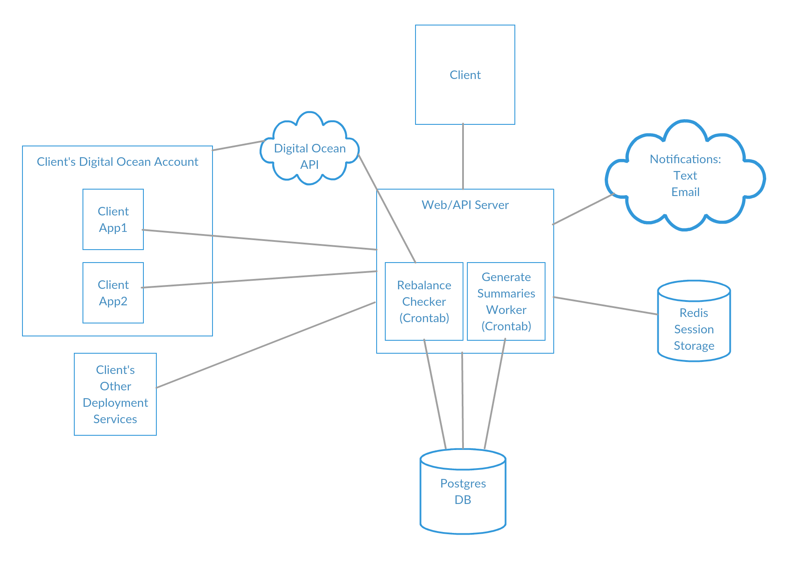

# DJ Deploy


## Table of Contents
1. [Introduction](#introduction)
2. [Team](#team)
3. [Usage](#usage)
  - [Basic Installation](#basic-intallation)  
  - [Auto Scaling](#auto-scaling) 
4. [Development](#development)
  - [Requirements](#requirements)
  - [Installing Dependencies](#installing-dependencies)
  - [Development Sever](#development-server)
  - [Scheduling Tasks](#scheduling-tasks)
  - [Example Data and Application](#example-data-and-application)
  - [Testing](#testing)
  - [Application Architecture](#application-architecture)
5. [Contributing](#contributing)
6. [License](#license)

## Introduction

DJ Deploy is an easy way to monitor and mange your deployments. The core of DJ Deploy is comprised of an express middleware package which counts requests on the installed route. Advanced users can also use our service auto-scale their deployments (DigitalOcean currently supported) based on the same traffic data.



## Team
  - __Product Owner__: Product Owner
  - __Scrum Master__: [Rane Gridley](https://github.com/ranebo)
  - __Development Team Members__: [Matt Bresnan](https://github.com/mbresnan1701), [Roland Fung](https://github.com/rolandfung)


## Usage

### Basic installation
DJ Deploy runs as middleware in your Express application. If you are an end-user, follow these steps get started.

1. To install to your app, run: `npm install --save lib-dj-deploy`, import the initClient function into your code as seen below.
2. Configure your application information, using `sample.js` as an example. You MUST use the same Github handle you plan to use to login with to see your application in the web app.
3. Import our middleware from `lib/libstats.js` and drop it into the routes you want to monitor in your application. For example, to use on all routes:

```
var express = require('express');
var libstats = require('lib-dj-deploy');
var app = express();

app.use(libstats.initClient(app, {
  username: 'dingdong',   /* your github username                      */
  name: 'test',          /* your app name                             */
  port: 8080,            /* your app port number                      */
  interval: 600000,      /* reporting interval (ms). 10 min suggested */
  url: 'http://djdeploy.com/stats'
}));
```

If you only intend to use DJ Deploy for monitoring, you're all done! Log into www.DJDeploy.com with the same Github credentials to see traffic information. The middlware will register your application with us automatically.

### Auto-Scaling
If you have your application running on a Nginx load balancer, DJ Deploy can auto-scale your application based on custom triggers. DJ Deploy's autoscaling is supported on the following platforms: DigitalOcean.

#### How it works
DJ Deploy continually compares the traffic information to the scaling thresholds set for that application. When triggered, DJ Deploy will call on the platform API to spin up or destroy servers on your behalf, then instruct your Nginx load balancer to add it as a slave.

#### Enabling auto-scale
1. Create a new API token for us to use. From the DigitalOcean homepage, for example, you can do this from 'API > Generate New Token'.
3. Add this token to your profile at www.DJDeploy.com
2. Create a snapshot image of your DJ Deploy'ed application for us to use. From a DigitalOcean droplet page, for example, this can be done from 'Snapshots' in the droplet's menu.
4. Place a configuration file on your Nginx load balancer so that it will open up a port and listen for commands from our server (see the Load Balancers page for specific instructions.)
5. Set scaling thresholds, specify the max number of servers, and select the image you made earlier from the DJ Deploy site. You're done! We'll let you know when a scaling operation is performed via your Github email.


## Development

### Requirements
- Node 5.x
- Redis 3.x
- Postgresql 9.5.x
- Github developer application credentials
- Cron for scheduling tasks
- **Nginx+ load balanced system to run scaling features**

### Installing Dependencies
Run `npm install` from the root directory. If the NODE_ENV variable is set to production, the webpack bundle will be built as well.

Set the correct environment variables:
```
export PG_CONNECTION_STRING=postgres://localhost
export REDIS_CONNECTION_STRING=redis://localhost
export GITHUB_CLIENT_SECRET=YOUR_SECRET_HERE
export MAILGUN_SECRET=YOUR_SECRET_HERE
export GITHUB_CLIENT_SECRET=YOUR_GITHUB_CLIENT_SECRET
export GITHUB_CLIENT_ID=YOUR_GITHUB_CLIENT_ID
export GITHUB_CALLBACK_URL=http://localhost:1337/auth/github/callback
export SESSION_SECRET=YOUR_PASSPORT_SESSION_SECRET
```

### Development Server

Simply run `npm start` to fire up the express server and Webpack middleware which serves a live, hot-reloading version of the application (about 7MB). Ensure Postgres and Redis are running before you start the server.

To serve the bundled file in a dev environment (simulating a prod environment):
1. run `webpack --config webpack.production.config.js` to create the bundle in the /build folder (20-30 sec). The bundled file (before gzip) is about 800kb.
2. change isDeveloping to 'false' in server/server.js
3. npm start

Remember to delete the build file before resuming development, or Webpack will keep serving this file to you.

### Scheduling Tasks

Our current implementation use a crontab file to perform tasks which summarize daily data and check server load. Below is an example.

```
1 0 * * * source ~/PATH_TO_ENV_VARS && /usr/local/bin/node /var/app/djdeploy/server/summaries/generateSummaries.js
0,30 * * * * source ~/PATH_TO_ENV_VARS && /usr/local/bin/node /var/app/djdeploy/server/checkBalancers/checkBalancers.js
```
  
### Example Data and Application
- Generate example traffic data:
```
node seed_data/index.js GITHUB_USER_NAME
```
- Generate example summary data:
```
node server/summaries/generateSummaries.js
```
- You can run a sample user application to start sending data to your DJ Deploy instance by running the following file
``` 
node middleware/sample.js
```


### Testing
Run the test Mocha-Chai suite with `npm test`


### Application Architecture ###

```
  +----------------+                             +---------------------------+
  | User interface |    Credentials, commands    |                           |
  | * add app (LB) +----------------------------->                           |
  | * add creds    |                             |                           |
  | * see stats    |Email and text notifications |                           |
  |                <-----------------------------+                           |
  +----------------+                             |         DJ Deploy         |
  +----------------+                             |                           |
  |                |                             | *collect stats            |
  | Redis Session  +-----------------------------> *prepare summaries        |
  |     Store      |    Github OAuth2 based      | *associate LB to ser^ers  |
  |                |   session authentication    | *command LB and platform  |
  |                <-----------------------------+  apis                     |
  +----------------+     Platform API calls      |                           |
  +----------------+                             |                           |
  |                |                             |                           |
  |   PostgreSQL   +----------------------------->                           |
  |                |    User and application     |                           |
  |                |       traffic data          |                           |
  |                <-----------------------------+                           |
  +----------------^                             |                           |
                     Platform API calls          |                           |
   +---------------------------------------------+                           |
   |  +------------------------------------------>                           |
   |  |             Droplet and image info       +-----------^-+----^--------+
   |  |                                                      | |    |
   |  |                                                      | |    |
+--v--+--------+   +-----------------------+                 | |    |
|              |   |                       |                 | |    |
|  Deployment  |   |                       |                 | |    |
| Platform API |   |         NGINX         |                 | |    |
|              |   |     Load Balancer     |   Load balance  | |    |
+--+-----------+   |                       |   configuration | |    |
   |               |                       +-----------------+ |    |
   |               |                       <-------------------+    |
   |               |                       |    Unhook/hookup       |
   |               |                       |   new app servers      |
   |               +---------+-+-+---------+                        |
   |                         | | |                                  |
   | Create/destroy          | | |    Route web                     |
   | droplet from            | | |    Traffic                       |
   | an image                | | |                                  |
   |                  +------v-v-v-------+                          |
   |                  |                  |                          |
   |                  |                  |                          |
   |                  |   Droplet 1      |                          |
   |                  |   ...            +--------------------------+
   |                  |   Droplet n      |   Traffic information
   +--------------------> Droplet n+1    |
                      |                  |
                      |                  |
                      +------------------+


```


## Contributing

See [CONTRIBUTING.md](CONTRIBUTING.md) for contribution guidelines.

## License
See [License](/LICENSE)


